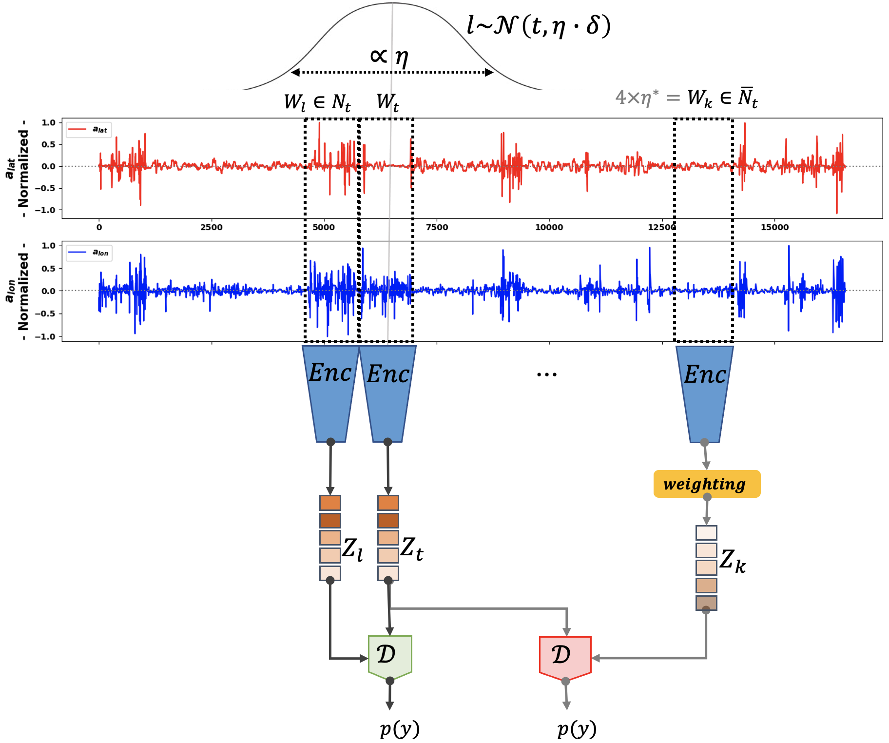

# Temporal Neighborhood Coding for Maneuvering (TNC4maneuvering)

<div style="text-align:center;">
    
</div>

This repository implements the Temporal Neighborhood Coding for Maneuvering (TNC4maneuvering) framework, which aims to understand maneuverability in smart transportation using acceleration datasets.


## Requirements

List of package dependencies required, along with their versions used for training and testing the model (see requirements.txt). To install them, you can run: ```python3 -m pip install -r requirements.txt```

## Code usage

**Window size selection**

For selecting a suitable window size, simply exercute:

```bash
python3 dataset/windowsize_selection.py --data <operational_day> --window_size0 <initial_size> --steps < step_size> --window_sizeT <terminal_size> --n_evals <no_evals>
```

**Data pre-processing**

This preprocessing script is useful for the three datasets. You can prepare your datasets by running:

```bash
python3 dataset/preprocessing.py --data <operational_day> --window_size <window_size> --p_value <pvalaue>
```

**Training**

For training TNC4maneuvering encoder model, simply exercute: 

```bash
python3 -m tnc4maneuvering.tnc4maneuvering --dataset <operational_day> --train --cv <no_of_cv> --w <weight_t>
```

To evaluate downstream tasks of classification, clusterability, and multilinear regression, pre-pruning use:


```bash 
python3 -m evaluations.classification --dataset <operational_day>
python3 -m evaluations.clustering --dataset <operational_day>
python3 -m evaluations.multlin_regression --dataset <operational_day>
```

For further evaluation of downstream tasks with PCA pruning use:

```bash
python3 -m evaluations.prunedPCAclass --dataset <operational_day>
python3 -m evaluations.clustering --dataset <operational_day>
python3 -m evaluations.multlin_regression --dataset <operational_day>
```

For further evaluation of downstream tasks with PCC pruning use:

```bash 
python3 -m evaluations.prunedPCCclass --dataset <operational_day>
python3 -m evaluations.clustering --dataset <operational_day>
python3 -m evaluations.multlin_regression --dataset <operational_day>
```

<!-- 
## Reference
Lebese, Thabang, et al. Unsupervised Representation Learning for Smart Transportation. IDA 2024 .... (to be updated)
 -->

## Contact
If you have questions, please create an issue or email thabang.lebese@sigma-clermont.fr | This work adopted the TNC framework, based on the papers
[1](https://arxiv.org/pdf/2106.00750) and [2](https://ieeexplore.ieee.org/iel7/10159234/10159280/10159325.pdf?casa_token=YFXQY5R3grAAAAAA:FKNaWX5hElYeRG3Pfg_v28Heqpqsn_ZyGSjL3wfajzSoQ4c7c6pm_G45s9gOK97C38xc17Ym9_8).
